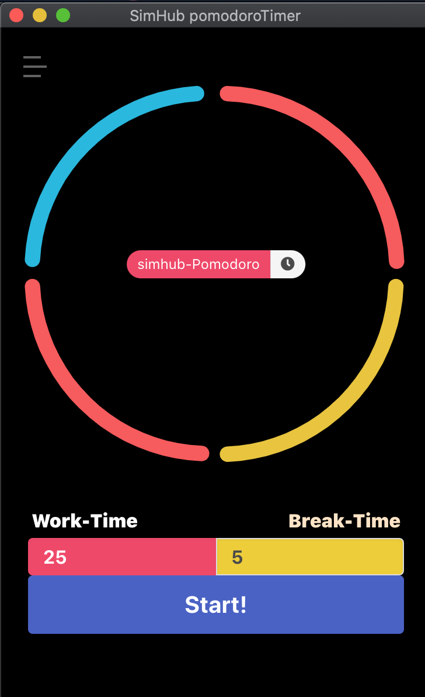
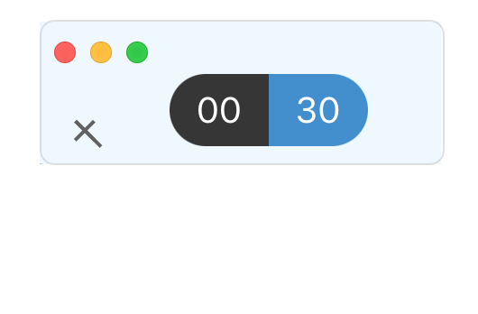

# simhub-pomodoro-timer  
----------------------------


# Quick start

Make sure you have [Node.js](https://nodejs.org) installed, then type...
```
git clone https://github.com/szwacz/electron-boilerplate.git
cd simhub-pomodoro-timer
npm install
npm start
```

